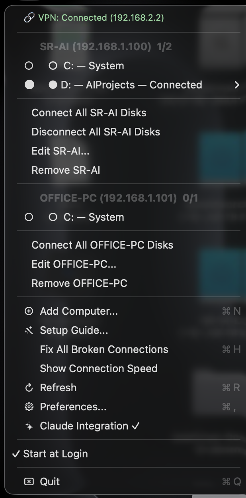
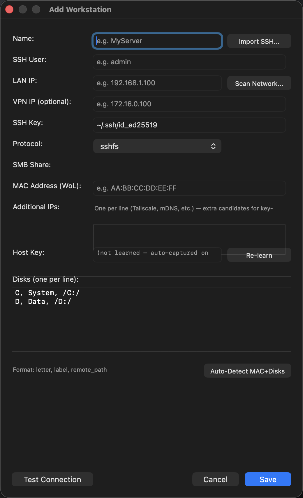
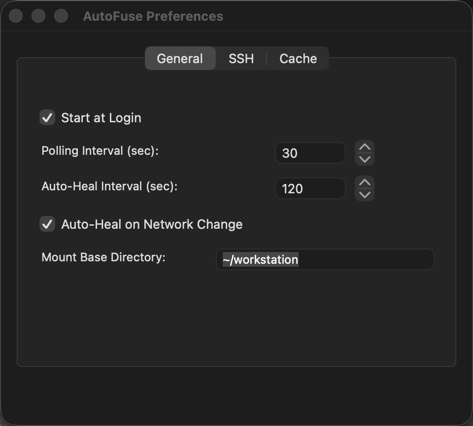

# AutoFuse


> **Remote disks that mount themselves — and an MCP server so your AI agent can manage them.**

AutoFuse is a macOS menu bar app that keeps remote machines' disks mounted over SSHFS: network auto-discovery, Wake-on-LAN, self-healing reconnection, near-zero idle energy. It ships with a **Model Context Protocol server exposing 30+ tools**, so Claude Code, Claude Desktop, or any MCP client can mount, heal, wake, browse, and run commands on your workstations — hands-free.

```
You:    "I need the training runs from my GPU workstation"
Agent:  wake_and_wait("ml-workstation")          → machine is up
        mount_disk("ml-workstation", "D")        → mounted_lan
        ~/workstation/training-runs/ is now a local folder.
```

<p align="center">
  
</p>

### Why agents work well with it

- **One intent-level call** (`quick_connect`, `fix_it`, `diagnose`) instead of fragile ssh/sshfs incantations the model has to compose and debug
- **`run_remote_shell`** over host-key-verified SSH — the agent can operate the remote box, not just read its files
- **Self-healing mounts** — a long agentic task doesn't die because WiFi flapped; AutoFuse reconnects underneath it
- **Structured, parseable results** — every tool returns machine-readable statuses designed for LLM consumption, not human-formatted text to scrape

For humans: **no terminal knowledge required.** A step-by-step Setup Guide in the menu bar walks you through everything.

## Features

- **MCP Server for AI agents** — 30+ tools over the Model Context Protocol: mount, heal, wake, discover, diagnose, remote shell ([full list](#available-tools))
- **Auto-Discovery** — Scans your network to find remote computers, imports SSH config, auto-detects disks, MAC address, and OS
- **Wake-on-LAN** — Wake up sleeping computers directly from the menu bar
- **Auto-Heal** — Automatically reconnects when your WiFi changes, your Mac wakes from sleep, or a connection drops
- **Multi-Computer** — Connect to multiple remote computers, each with multiple disks
- **Setup Wizard** — Step-by-step guide that installs everything you need and configures your first connection
- **Native macOS** — 300KB Objective-C binary, runs from the menu bar with zero CPU usage when idle
- **CLI Tool** — `autofuse` command for terminal users and scripting
- **FUSE-T + macFUSE** — Works with either backend, auto-detects which is installed
- **Preferences** — Native preferences window for SSH, cache, and connection settings
- **Team Sharing** — Export/import workstation configs for team onboarding
- **Connection Health** — Latency and throughput monitoring for each mount
- **Secure** — SSH key authentication, no passwords stored, config file encrypted with 0600 permissions

## Screenshots

<table>
  <tr>
    <td align="center"><b>Menu Bar</b><br>per-disk status, one-click actions</td>
    <td align="center"><b>Add Computer</b><br>auto-detect disks, MAC, host key</td>
    <td align="center"><b>Preferences</b><br>polling, auto-heal, SSH, cache</td>
  </tr>
  <tr>
    <td></td>
    <td></td>
    <td></td>
  </tr>
</table>

## Installation

### What You Need

- **macOS 13.0** (Ventura) or later
- **FUSE-T** (recommended) or macFUSE — lets your Mac see remote files as local folders

### Step 1: Install FUSE-T

Open Terminal and run:
```bash
brew tap macos-fuse-t/homebrew-cask
brew install fuse-t
brew install fuse-t-sshfs
```

Don't have Homebrew? Install it first: https://brew.sh

> **Alternative:** If you prefer macFUSE, download it from https://osxfuse.github.io and then run `brew install sshfs`. Note: macFUSE requires a kernel extension and may need Recovery Mode on Apple Silicon Macs.

### Step 2: Install AutoFuse

**Option A — Homebrew cask (recommended):**
```bash
brew install --cask Fasen24-AI/tap/autofuse
```
On Homebrew 6+, trust the tap first: `brew tap Fasen24-AI/tap && brew trust fasen24-ai/tap`.

**Option B — Download the App:**
1. Download `AutoFuse-<version>.zip` from [Releases](https://github.com/Fasen24-AI/autofuse/releases)
2. Unzip and drag AutoFuse.app to your Applications folder
3. Launch AutoFuse — it appears in your menu bar

**Option C — CLI Only (Homebrew formula from this repo):**
```bash
git clone https://github.com/Fasen24-AI/autofuse.git
brew install --formula ./autofuse/autofuse.rb
```

### Step 3: Follow the Setup Guide

Click the AutoFuse icon in your menu bar and select **Setup Guide**. It will walk you through:
1. Verifying FUSE-T is installed
2. Creating an SSH key (if you don't have one)
3. Finding and connecting to your remote computer
4. Mounting your first disk

## Quick Start (for experienced users)

```bash
# Install dependencies
brew tap macos-fuse-t/homebrew-cask && brew install fuse-t fuse-t-sshfs

# Launch the app
open /Applications/AutoFuse.app

# Or use the CLI
autofuse discover          # Scan network for computers
autofuse probe 192.168.1.5 # Detect OS, disks, MAC address
autofuse mount             # Mount all configured disks
autofuse status            # Show connection status
autofuse wake MyServer     # Wake a sleeping computer
autofuse health            # Check connection latency and speed
```

## Claude Integration (MCP Server)

AutoFuse includes a **Model Context Protocol (MCP) server** that exposes all AutoFuse capabilities to Claude Desktop, Claude Code, and other MCP clients. This lets you control AutoFuse directly from Claude conversations.

### Quick Setup (One-Click in Menu Bar)

For most users, installation is **one click**:

1. Click the AutoFuse menu bar icon
2. Select **"Enable Claude Integration..."**
3. Follow the setup wizard
4. Restart Claude Desktop — done!

The wizard will check for Node.js, copy the MCP server to your system, and configure Claude Desktop automatically.

### Claude Code (one-liner)

```bash
cd mcp-server && npm install && npm run build
claude mcp add autofuse -- node "$(pwd)/dist/index.js"
```

### Other agents (Cursor, Codex CLI, Gemini CLI, OpenClaw, …)

AutoFuse speaks plain **stdio MCP** — any MCP client can use it. After
`cd mcp-server && npm install && npm run build`, point your client at
`node <repo>/mcp-server/dist/index.js`:

| Agent | Where to configure |
|---|---|
| **Cursor / Windsurf / Cline** | `mcp.json` → `{"mcpServers": {"autofuse": {"command": "node", "args": ["<path>/dist/index.js"]}}}` |
| **Codex CLI** | `~/.codex/config.toml` → `[mcp_servers.autofuse]` with `command`/`args` |
| **Gemini CLI** | `~/.gemini/settings.json` → same `mcpServers` JSON shape |
| **OpenClaw & skill-based agents** | bridge MCP (e.g. mcporter), or skip MCP entirely and wrap the **`autofuse` CLI** — `autofuse json status` returns JSON (zero parsing), and every command emits stable, parseable output (`mounted_lan:/path`, `failed:<reason>`) designed for scripting |

Per-client snippets: [mcp-server/README.md](mcp-server/README.md).

### Advanced: Manual Installation

If you prefer manual setup:

```bash
cd mcp-server
./install.sh
```

The installer automatically configures Claude Desktop or Claude Code. Restart Claude and you'll have access to 30+ AutoFuse tools.

> Every tool ships [MCP behavior annotations](https://modelcontextprotocol.io/specification/2025-03-26/server/tools#tool-annotations): the 18 read-only tools (status, health, discovery, …) can be safely auto-approved by your client, while destructive ones (`unmount_disk`, shells) always warrant a confirmation prompt. Known engine errors come back with a `hint:` line telling the agent the next step (e.g. `host_key_mismatch` → run `learn_host_key`).

### Available Tools

**Quick Actions (high-level, intent-based):**
- `quick_connect` - Mount everything in one call
- `quick_disconnect` - Unmount everything
- `fix_it` - Detect and repair whatever is broken
- `locate` - Find where a workstation/disk is mounted
- `diagnose` - Full health + connectivity diagnostic
- `get_recent_activity` - Recent mount/heal/wake log entries
- `get_config` - Current config (SSH key path only, never key contents)

**Mount Operations:**
- `mount_disk` - Mount a remote disk
- `unmount_disk` - Unmount a disk
- `get_mount_status` - Check a mount's status
- `get_all_mount_status` - See all mounts at once

**Workstation Management:**
- `list_workstations` - List configured workstations
- `get_disks` - See available disks on a workstation
- `wake_workstation` - Send Wake-on-LAN signal
- `wake_and_wait` - Wake and wait for connectivity
- `ping_workstation` - Check if a workstation is reachable

**Health & Recovery:**
- `get_health_status` - Detailed health monitoring
- `heal_stale_mount` - Repair a broken mount
- `panic_check` - Find unhealthy mounts
- `panic_unmount_all` - Emergency unmount all

**Network Discovery:**
- `scan_network` - Scan for available hosts
- `probe_host` - Check specific host connectivity
- `detect_vpn` - Check VPN status

**Host-key identity (cross-network same-machine verification):**
- `learn_host_key` - Capture the workstation's SSH host-key fingerprint into config
- `verify_host_key` - Check each endpoint's current key against the stored fingerprint
- `pick_endpoint` - Show which endpoint AutoFuse would use right now (key-verified when a fingerprint is stored)

**System:**
- `check_dependencies` - Verify all required tools are installed

**Finder Access:**
- `open_in_finder` - Open a mounted disk in Finder
- `reveal_in_finder` - Reveal a path in Finder (restricted to mounted AutoFuse disks)

**Unrestricted Shell (single-tenant — see SECURITY.md):**
- `run_local_shell` - Run a local shell command
- `run_remote_shell` - Run a command on a workstation over host-key-verified SSH

> Some tools expose backward-compatible aliases (e.g. `reconnect_disk`↔`heal_stale_mount`, `check_for_stuck_mounts`↔`panic_check`, `force_unmount_all`↔`panic_unmount_all`).

### Example Usage in Claude

```
User: "Mount the D drive on ml-workstation"
Claude: [calls mount_disk(workstation="ml-workstation", disk_letter="D")]
Result: Mount successful, available at ~/workstation-D

User: "Check the health of all my mounts"
Claude: [calls get_health_status()]
Result: All mounts healthy, average latency 45ms
```

See [mcp-server/README.md](mcp-server/README.md) for complete documentation.

## CLI Usage

```
autofuse                     Show status of all connections
autofuse mount [name] [disk] Connect a disk (all if no args)
autofuse unmount [name]      Disconnect a disk
autofuse status              Detailed status with colors
autofuse wake <name>         Wake up a sleeping computer
autofuse heal                Fix broken connections
autofuse discover            Scan network for computers
autofuse probe <host>        Detect OS, disks, MAC of a host
autofuse health              Show latency and speed per disk
autofuse log                 Show recent activity log
autofuse config              Open config file in your editor
autofuse connect <name>      Ping, wake if asleep, mount all its disks
autofuse json [what]         JSON output: status|health|list|disks <name>
autofuse raw <cmd> [...]     Direct engine access (any mount.sh subcommand)
autofuse version             Show version
autofuse help                Show all commands
```

## Configuration

Config file: `~/.config/autofuse/config.json`

```json
{
  "workstations": [
    {
      "name": "MyPC",
      "user": "admin",
      "lan_ip": "192.168.1.100",
      "vpn_ip": "172.16.0.100",
      "mac_address": "AA:BB:CC:DD:EE:FF",
      "ssh_key": "~/.ssh/id_ed25519",
      "disks": [
        { "letter": "C", "label": "System", "remote_path": "/C:/" },
        { "letter": "D", "label": "Data", "remote_path": "/D:/", "primary": true }
      ]
    }
  ],
  "mount_base": "~/workstation"
}
```

The `primary` disk mounts at the base path (`~/workstation`). Other disks mount at `~/workstation-C`, `~/workstation-D`, etc.

## How It Works

```
Your Mac                              Remote Computer
+------------------+                  +------------------+
| AutoFuse         |     SSH tunnel   | OpenSSH Server   |
| (menu bar app)   | ===============>| (built into      |
|                  |                  |  Windows/Linux)  |
| FUSE-T/macFUSE   |     SFTP        |                  |
| translates files |<===============>| Files on disk    |
| to Finder        |                  |  C:, D:, etc.   |
+------------------+                  +------------------+
     |
     v
  ~/workstation/
  (looks like a local folder)
```

1. **SSH** creates an encrypted tunnel to the remote computer
2. **SSHFS** uses that tunnel to access files via the SFTP protocol
3. **FUSE-T** (or macFUSE) makes those files appear as a normal folder on your Mac
4. **AutoFuse** manages all of this automatically — reconnecting, healing, waking

## Architecture

AutoFuse is three thin layers over **one source of truth**. All mount logic
lives in the bash engine; the menu-bar app and the MCP server are two
front-ends that call the same commands, so a human clicking the menu and an
agent calling a tool always get identical behavior.

```
   Menu-bar app                MCP server
   (main.m, ObjC)              (mcp-server/, TypeScript)
        |                            |
        |  shells out                |  shells out
        +-------------+--------------+
                      v
              Bash engine  ←── single source of truth
        (mount.sh + discover.sh)
                      |
                      v
            ssh · sshfs · wake-on-LAN
```

| Layer | Files | Responsibility |
|-------|-------|----------------|
| **Menu-bar app** | `main.m` | Single-file AppKit app: status item, adaptive poll/heal timers, notifications, preferences, setup wizard. Holds no mount logic of its own — every action shells out to the engine. Compiles to a ~370 KB native binary, no runtime dependencies. |
| **Bash engine** | `mount.sh`, `discover.sh` | The source of truth: probe, mount, unmount, heal-stale, wake-on-LAN, endpoint selection (LAN/VPN/extra IPs), and host-key verification. Pure bash + `ssh`/`sshfs`. Emits line-oriented, parseable status (`host|disk|status:mountpoint`) and uses exit-code-as-signal. |
| **MCP server** | `mcp-server/` (TypeScript) | Exposes the engine to AI agents over the Model Context Protocol (stdio). Each tool shells to `mount.sh`, parses its output, and returns structured JSON carrying [behavior annotations](https://modelcontextprotocol.io/) (`readOnlyHint`, `destructiveHint`, …) so clients can auto-approve safe reads and gate destructive writes. |

**Why this shape:** the engine is testable in isolation (`bash test.sh`, 82
cases) and is the only place mount behavior is defined, so the app and the
agent interface can never drift apart. Adding an action means adding one engine
subcommand; both front-ends pick it up. See
[CONTRIBUTING.md](CONTRIBUTING.md) for the conventions each layer follows.

## Team Sharing

Share your computer configs with teammates:

```bash
# Export (excludes SSH keys and MAC addresses for security)
autofuse export-config > team-mounts.json

# Import on another Mac
autofuse import-config team-mounts.json
```

## Building from Source

```bash
git clone https://github.com/Fasen24-AI/autofuse.git
cd autofuse

# Compile the app
clang -fobjc-arc -framework Cocoa -framework UserNotifications \
    -framework ServiceManagement -o AutoFuse main.m

# Build and install the .app bundle
bash build.sh

# Run tests
bash test.sh
```

## Troubleshooting

**"App can't be opened because it is from an unidentified developer"**
Right-click the app → Open → Open. This only needs to be done once.

**Connection fails after Mac sleeps**
AutoFuse auto-heals within 2 minutes. Click "Fix Broken Connections" in the menu for immediate reconnection.

**Slow file access**
Open Preferences (Cmd+,) → Cache tab → increase Cache Timeout and enable Kernel Cache.

**Can't connect to Windows PC**
Make sure OpenSSH Server is enabled on Windows: Settings → System → Optional Features → OpenSSH Server.

**"sshfs is not installed" / no FUSE backend**
Install a FUSE backend and SSHFS: either FUSE-T + `sshfs` from [fuse-t.org](https://www.fuse-t.org), or `brew install macfuse && brew install gromgit/fuse/sshfs-mac`. AutoFuse detects either at launch.

**"Host key doesn't match" / security check failed**
The remote SSH identity changed since AutoFuse learned it. If you reinstalled the server, open **Edit Workstation → Re-learn Host Key**. If you didn't, investigate before reconnecting — this is the warning you want.

**A disk shows "stale" and won't clear**
The server became unreachable while mounted. AutoFuse force-cleans and re-heals on the next pass; for an immediate fix click **Fix Broken Connections**, or run `autofuse heal <workstation>`.

**Claude/agent doesn't see the MCP tools**
Node 18+ must be on `PATH`. Check the menu's Claude Integration panel for status, then re-run the one-liner under [Claude Integration](#claude-integration-mcp-server). Verify the server starts with `cd mcp-server && npm test`.

See the full [Setup Guide](docs/GUIDA-SSHFS-FUSE-T.md) for detailed instructions.

## Contributing

We welcome contributions! See [CONTRIBUTING.md](CONTRIBUTING.md) for guidelines on:
- Reporting bugs
- Suggesting features
- Development setup
- Code style
- Pull request process

## License

**PolyForm Shield License 1.0.0** — see [LICENSE](LICENSE) for details.

**What this means in plain English:**

- ✅ You can use AutoFuse for **any purpose**, including commercially inside your company
- ✅ You can **modify** the source code for your own needs
- ✅ You can **contribute improvements** back to this project via pull requests
- ✅ You can redistribute copies (with source and license attached)
- ❌ You **cannot create a competing product** based on AutoFuse
- ❌ You **cannot fork** AutoFuse and publish it as a separate commercial product

If unsure about your use case, please open a discussion or contact the author.

## Security

Found a security vulnerability? See [SECURITY.md](SECURITY.md) for responsible disclosure.

## Credits

Built by Fasen24-AI.
